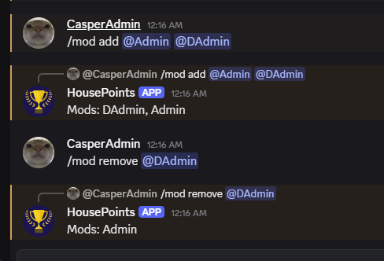
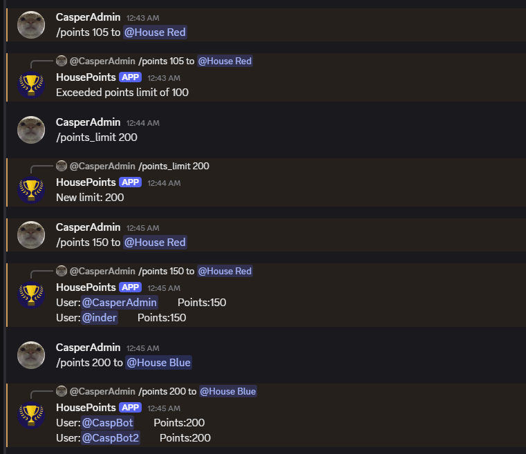
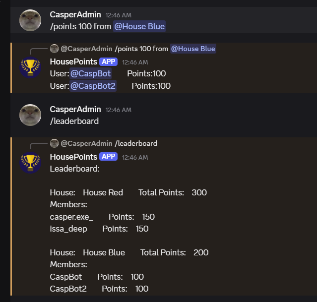

**Most important: Use `/sync` command first!**

**Next: Use `/register_houses` command to set up your houses**

HousePoints Discord Bot helps keep track of points of houses. Add new houses, members to houses. Add or deduct points from members/houses. Show Leaderboard. 
Create a .env file (using text editor) in the program folder (same folder as the python program file) 
Type ```TOKEN=YOUR-DISCORD-BOT-TOKEN``` in .env file then run the python file

## Screenshots

### Moderator Management

*Add and remove moderators using `/mod add @user` and `/mod remove @user` commands*

### Adding Points

*Add points to houses using `/points [amount] to @House [Name]` command*

### Deducting Points

*Deduct points from houses using `/points [amount] from @House [Name]` command*